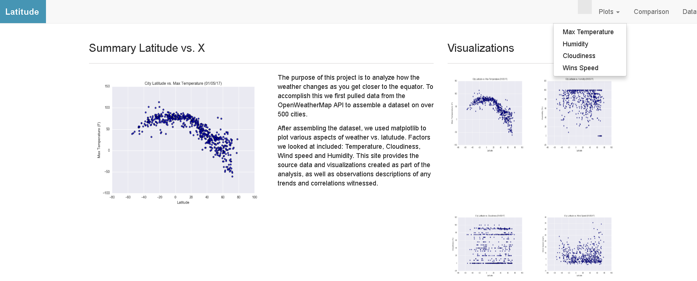
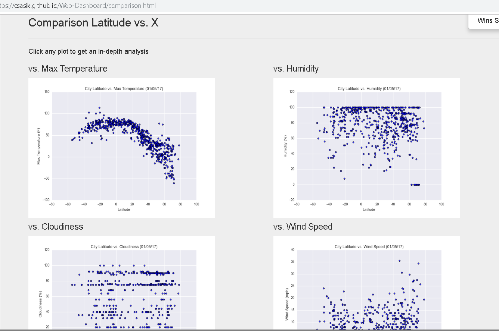
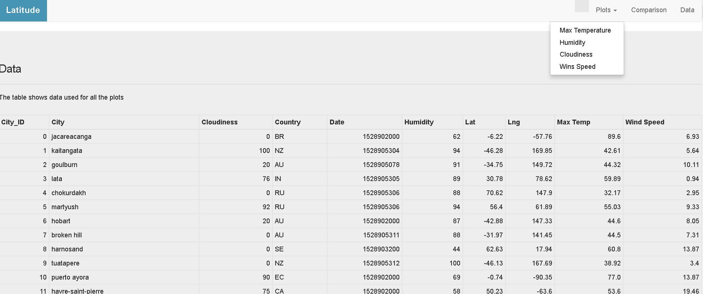

Web Visualization Dashboard (Latitude)

## Background

Data is more powerful when we share it with others! 

## Latitude - Latitude Analysis Dashboard with Attitude

Creating a visualization dashboard website to plot the  [weather data](Resources/cities.csv).

In building this dashboard, I've created individual pages for each plot and a navbar to navigate between them. These pages will contain the visualizations and their corresponding explanations. There is also a landing page, a page where we can see a comparison of all of the plots, and another page where we can view the data used to build them.

### Website Requirements

See the ["Screenshots" section](#screenshots) below.

* A [landing page](#landing-page) containing:
  * An explanation of the project.
  * Links to each visualizations page.
* Four [visualization pages](#visualization-pages), each with:
  * A descriptive title and heading tag.
  * The plot/visualization itself for the selected comparison.
  * A paragraph describing the plot and its significance.
* A ["Comparisons" page](#comparisons-page) that:
  * Contains all of the visualizations on the same page so we can easily visually compare them.
  * Uses a bootstrap grid for the visualizations.
    
* A ["Data" page](#data-page) that:
  * Displays a responsive table containing the data used in the visualizations.
    

### Screenshots

This section contains screenshots of each page 

#### Landing page

Large screen:

#### Comparisons page

Large screen:

#### Data page

Large screen:

#### Visualization pages

Large screen:

